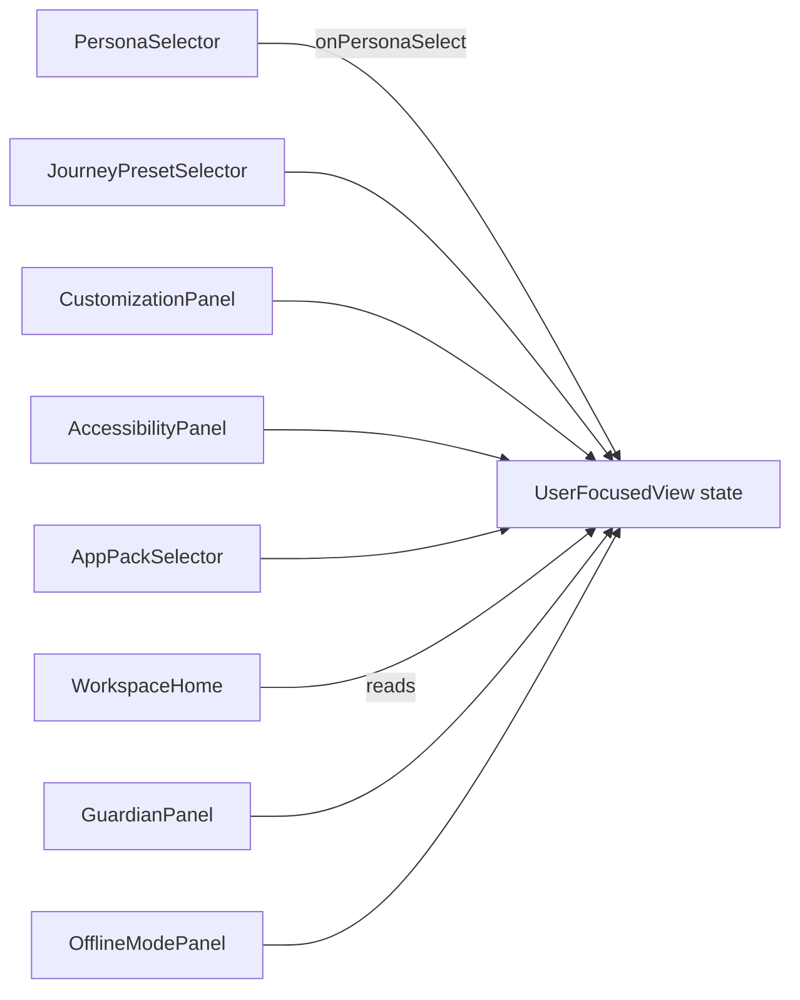

# Launcher Component Map

**Status:** device OS alpha · React component inventory  
**Root:** `apps/launcher_mock/src/`

> This is a user-focused OS alpha package and launcher/customization framework. It is not yet a finished shipping OS image.

---

## Component table

| Component | Purpose | Inputs | Outputs | Accessibility requirement | Test evidence |
|-----------|---------|--------|---------|---------------------------|---------------|
| `App.tsx` | Root shell; fleet vs user-focused routing | `view` state, campus/device/mode selects | Rendered fleet UI or `UserFocusedView` | View-switch buttons labeled; min 44px user-focused entry | Manual demo; doc test `test_launcher_architecture_docs.py` |
| `Panel` (inline) | Fleet info card wrapper | `title`, `children` | Styled section with `<h3>` | Heading per panel | Manual |
| `UserFocusedView.tsx` | User-focused tab shell and global a11y state | Tab ID, persona, preset, toggles | Active panel render | `nav` landmark, `aria-current`, font scaling | Manual |
| `PersonaSelector.tsx` | Choose learner/creator persona | `persona`, `onSelect` | Persona card selection | Button labels from persona name | `validate_persona_coverage.py` (Python parity) |
| `JourneyPresetSelector.tsx` | Choose scooter→spaceship preset | `preset`, `onSelect`, `depth` | Preset + depth selection | Focusable preset cards | `validate_user_focused_os.py` |
| `CustomizationPanel.tsx` | Theme and UI depth | `theme`, `depth`, setters | Theme/depth state | Contrast-safe theme names displayed | Manual |
| `AccessibilityPanel.tsx` | Large text, high contrast, reduced motion | Boolean toggles | Updates parent style state | Toggle labels visible | `demo/accessibility_walkthrough.md` |
| `AppPackSelector.tsx` | Select app pack | `appPack`, `onSelect` | Pack ID | Pack name text on buttons | `tests/test_app_pack_manager.py` (Python) |
| `WorkspaceHome.tsx` | Summary home dashboard | persona, preset, pack, guardian, offline meta | Read-only summary | Readable hierarchy | Manual |
| `GuardianPanel.tsx` | Mock guardian enable | `guardian`, `onChange` | Guardian boolean | Plain-language mock disclaimer | `tests/test_guardian_policy.py` (Python policy) |
| `OfflineModePanel.tsx` | Mock offline enable | `offline`, `onChange` | Offline boolean | Explains offline-first alpha | `tests/test_offline` via offline manager |
| `deviceProfiles.ts` | Device/mode constants | — | `DEVICES`, `MODES`, ID maps | Used by labeled selects | `tests/test_device_classes.py` (YAML) |
| `appRegistry.ts` | Fleet app tile list | — | `APPS` array | App name on each button | `tests/test_app_registry.py` |
| `personaData.ts` | Persona metadata | — | `PERSONAS`, `PersonaId` | Persona display strings | `tests/test_persona_engine.py` |
| `presetData.ts` | Preset metadata | — | `PresetId` types | Preset display strings | `tests/test_journey_preset_engine.py` |

---

## Data flow (user-focused)

---

## Fleet-only components

Fleet layout is monolithic in `App.tsx` (no separate panel files). Extracting panels is a future refactor.

| UI block | Lines (approx.) | Mock data source |
|----------|-----------------|------------------|
| Campus blurb | `CAMPUS_BLURBS` | Static research scenarios |
| App grid | `APPS` from `appRegistry.ts` | Static list |
| Telemetry panel | `MOCK_TELEMETRY` | Synthetic constants |
| Deploy panel | `deviceId` from map | `deploy_contract.py` concept |

---

## Python parity matrix

| Launcher state | Python module | Sync in alpha? |
|----------------|---------------|----------------|
| Mode | `mode_manager.py` | Partial (manual maps) |
| Device | `device_classes.py` | Partial (`DEVICE_ID_MAP`) |
| Persona | `persona_engine.py` | Conceptual |
| Guardian | `guardian_controls.py` | Mock toggle only |
| Offline | `offline_mode_manager.py` | Mock toggle only |

---

## Test gap summary

| Gap | Priority |
|-----|----------|
| No Vitest/RTL tests for components | Medium |
| No axe-core in CI | Medium |
| No snapshot tests for high-contrast mode | Low |

---

## Related documents

- [LAUNCHER_MOCK_ARCHITECTURE.md](LAUNCHER_MOCK_ARCHITECTURE.md)
- [LAUNCHER_NAVIGATION_MODEL.md](LAUNCHER_NAVIGATION_MODEL.md)
- [apps/launcher_mock/README.md](../apps/launcher_mock/README.md)
