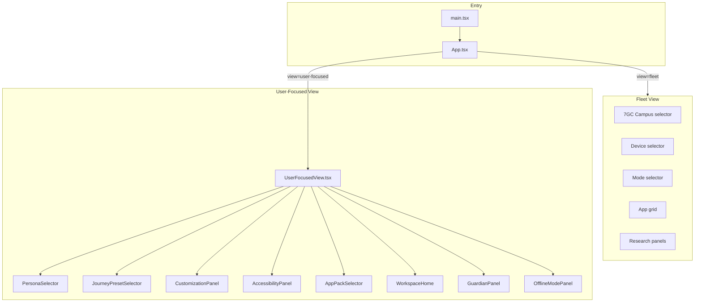

# Launcher Mock Architecture

**Status:** device OS alpha · React/Vite UX prototype  
**Path:** `apps/launcher_mock/`  
**Entry:** `src/App.tsx`, `src/main.tsx`

> This is a user-focused OS alpha package and launcher/customization framework. It is not yet a finished shipping OS image.

---

## Purpose

The launcher mock demonstrates **two complementary views** of gunnchOS:

1. **Fleet view** — research operator perspective: campus, device, mode, synthetic telemetry, deploy panel
2. **User-focused view** — scooter-to-spaceship personalization: persona, journey preset, customization, guardian, offline

It is a **UX contract and demo shell**, not an installable OS launcher binary.

---

## Stack

| Layer | Technology |
|-------|------------|
| UI | React 18 + TypeScript |
| Build | Vite 5 |
| Styling | Inline styles (dark theme, high-contrast toggle in user-focused view) |
| State | React `useState` (no global store in alpha) |
| Backend | None — all data is static TS modules or mirrors Python YAML conceptually |

---

## High-level architecture



---

## View switching

`App.tsx` holds `view: 'fleet' | 'user-focused'`.

- **Fleet → User-focused:** "Your device (scooter → spaceship)" button (`aria-label`: Switch to user-focused experience)
- **User-focused → Fleet:** Fixed "Fleet view" button (`aria-label`: Switch to fleet launcher view)

Both toggles use minimum 44px touch targets in user-focused navigation.

---

## Data modules

| Module | Role |
|--------|------|
| `deviceProfiles.ts` | Device and mode labels; `DEVICE_ID_MAP`, `MODE_ID_MAP` bridge to YAML IDs |
| `appRegistry.ts` | App tile names for fleet grid |
| `user-focused/personaData.ts` | 22 persona definitions (mirrors `config/personas.yaml` intent) |
| `user-focused/presetData.ts` | Journey preset IDs (Scooter → Spaceship) |
| `user-focused/AppPackSelector.tsx` | App pack list (mirrors `config/app_packs.yaml`) |

Python modules remain **source of truth** for policy; launcher mock is illustrative.

---

## Fleet view panels

| Panel | Content | Claim boundary |
|-------|---------|----------------|
| Telemetry (mock) | Synthetic latency, jitter, packet loss | Not field measurements |
| Privacy | Opt-in, no PII, synthetic tier | Aligns with privacy alpha docs |
| Security / boot | Secure boot target, TPM2 target | Planning only |
| Fleet / school | Enrolled count mock | Not real MDM |
| Research links | 7GC, Edge-IO, AI-RAN lab stubs | Cross-repo pointers |
| Deploy (DS-XL → device) | Mock deploy button | See `deploy_contract.py` |

Campus blurbs (Gary, Ghana, Guyana, Gaza, Geelong, Graham Land, Germany) encode **research scenario presets** — not operational deployments.

---

## User-focused view

Tab navigation (`aria-label`: User-focused sections) with `aria-current="page"` on active tab.

State lifted in `UserFocusedView.tsx`:

- Persona, journey preset, UI depth, theme, accessibility toggles, app pack, guardian flag, offline flag

Selecting a persona auto-advances to Journey tab and sets recommended preset.

---

## Relationship to Python package

| Python module | Launcher mock surface |
|---------------|----------------------|
| `mode_manager.py` | Fleet mode dropdown |
| `device_classes.py` | Device dropdown → `DEVICE_ID_MAP` |
| `guardian_controls.py` | GuardianPanel toggle |
| `offline_mode_manager.py` | OfflineModePanel |
| `persona_engine.py` | PersonaSelector |
| `journey_preset_engine.py` | JourneyPresetSelector |
| `deploy_contract.py` | Fleet deploy panel (mock button) |

No IPC or API connects mock UI to Python in alpha — demos run separately via `scripts/`.

---

## Run and build

```bash
cd apps/launcher_mock
npm install
npm run dev    # http://localhost:5173 typical
npm run build  # dist/
```

---

## Tests and gaps

| Check | Status |
|-------|--------|
| Doc existence | `tests/test_launcher_architecture_docs.py` |
| React unit tests | **Not implemented** (`npm test` echoes placeholder) |
| a11y audit | Manual — see `LAUNCHER_ACCESSIBILITY_CONTRACT.md` |
| Visual regression | None |

---

## Related documents

- [LAUNCHER_NAVIGATION_MODEL.md](LAUNCHER_NAVIGATION_MODEL.md)
- [LAUNCHER_ACCESSIBILITY_CONTRACT.md](LAUNCHER_ACCESSIBILITY_CONTRACT.md)
- [LAUNCHER_COMPONENT_MAP.md](LAUNCHER_COMPONENT_MAP.md)
- [apps/launcher_mock/README.md](../apps/launcher_mock/README.md)
