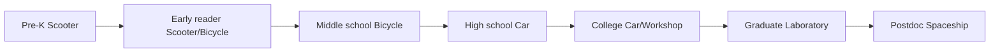

# Pre-K to Postdoc Use Cases

**Status:** device OS alpha · persona modeling — not user-tested with real participants  

> This is a user-focused OS alpha package and launcher/customization framework. It is not yet a finished shipping OS image.

This table maps educational and professional **stages** to default experience settings. Full persona details: `product/PERSONA_MATRIX.md`.

---

## Use case matrix

| User stage | Default preset | Primary needs | Safety needs | Customization style | Success moment |
|------------|----------------|---------------|--------------|---------------------|----------------|
| Pre-K (ages 3–5) | Scooter | Letter sounds, colors, touch games, caregiver co-use | Guardian required; strict filter; blocked browser/social; kid_safe theme; no telemetry without guardian consent | simple — large icons, no settings maze | Child completes first letter activity without help |
| Early reader (K–2) | Scooter / Bicycle | Reading practice, short writing, safe exploration | Guardian required; strict content filter; app approval on | simple → guided | Child reads a short story and saves progress |
| Middle school (6–8) | Bicycle | Homework, safe browsing, light coding, educational games | Moderate filter; school-mode restrictions; guardian optional | guided — progress widgets, explained choices | Student finishes assignment and shares with teacher |
| High school (9–12) | Car | Essays, research, coding classes, tutoring, games | School-safe browsing; play time windows; standard privacy | full — pin apps, calendar, homework widgets | Student submits essay and opens coding project in one session |
| College non-STEM | Car | Writing, research, presentations, streaming, notes | Standard privacy; no mandatory telemetry | full | Student completes research paper draft offline then syncs |
| College CS/STEM | Workshop | VS Code, Git, Python/C++, WSL, local preview | Dev tools with standard privacy; no root by default | full | Student runs and commits first project locally |
| Graduate researcher | Laboratory | Literature, data, field measurement, edge experiments | Research telemetry opt-in; strict field-data privacy | full → power_user | Researcher captures measurement and exports to edge-io bridge |
| Postdoctoral researcher | Spaceship | Advanced experiments, custom tooling, full system access | Minimal restrictions; explicit telemetry consent; audit log | power_user — import/export, advanced panels | Researcher runs custom experiment pipeline and exports results |

---

## Adjacent personas (same device, different primary stage)

| User stage | Persona ID | Default preset | Success moment |
|------------|------------|----------------|----------------|
| Parent/guardian | parent_guardian | Guardian | Approves app; sees age-appropriate home screen |
| Teacher/mentor | teacher_mentor | Classroom | Pushes offline-ready lesson to class |
| Artist (any age) | artist | Studio | Saves sketch and exports PNG |
| Writer (any age) | writer | Studio | Completes draft in focus mode |
| Musician (any age) | musician | Studio | Records idea and saves offline |
| Gamer (teen–adult) | gamer | Arcade | Launches game with controller in one tap |
| Game developer | game_developer | Workshop | Playtests level offline |
| Software engineer | software_engineer | Spaceship | Deploys from device to test environment |
| Hardware engineer | hardware_engineer | Workshop | Flashes test firmware; reads bench output |
| Cybersecurity learner | cybersecurity_learner | Workshop | Completes CTF in isolated lab mode |
| Wireless/6G researcher | wireless_6g_researcher | Laboratory | Captures URLLC sample; exports to research bridge |
| Library/community guest | library_community_user | Library | Completes session; device resets for next guest |
| Accessibility-first | accessibility_first_user | Scooter/Bicycle + a11y overrides | Navigates home with preferred input independently |
| Low-bandwidth/offline | low_bandwidth_offline_user | Offline | Completes full work session with no connectivity |

---

## Stage transitions (growth path)

Users may **skip** or **return** to simpler presets anytime (e.g. overwhelmed_user → Scooter). Guardian overlay can apply at any stage for youth accounts.

---

## Safety escalation by stage

| Stage | Guardian | Content filter | Screen time cap | App approval |
|-------|----------|----------------|-----------------|--------------|
| Pre-K | Required | strict | 30 min/day | yes |
| Elementary | Required | strict | 60 min/day | yes |
| Middle school | Recommended | moderate | 90 min/day | yes |
| High school | Optional | moderate | 120 min/day | no |
| College+ | Off | light | none | no |

Source: `guardian_controls.py` AGE_BAND_DEFAULTS (mock).

---

## Offline expectations by stage

| Stage | Offline priority |
|-------|------------------|
| Pre-K – middle school | WAIKE lessons, cached activities (required) |
| High school – college | Writing, PDFs, coding templates, licensed offline games |
| Graduate/postdoc | Field notes, measurement cache, local repos |
| Library guest | Essentials pack only; session reset on exit |

---

## Evidence and gaps

| Claim | Evidence | Gap |
|-------|----------|-----|
| All stages have persona + preset | `config/personas.yaml`, validator | No age verification UX |
| Success moments defined | PERSONA_MATRIX | Not measured in field |
| Stage-appropriate safety defaults | guardian_controls mock | Not production MDM |

---

## Related documents

- [SCOOTER_TO_SPACESHIP_MODEL.md](SCOOTER_TO_SPACESHIP_MODEL.md)
- [GUARDIAN_AND_YOUTH_SAFETY.md](GUARDIAN_AND_YOUTH_SAFETY.md)
- [OFFLINE_FIRST_USER_EXPERIENCE.md](OFFLINE_FIRST_USER_EXPERIENCE.md)
- `product/PERSONA_MATRIX.md`
