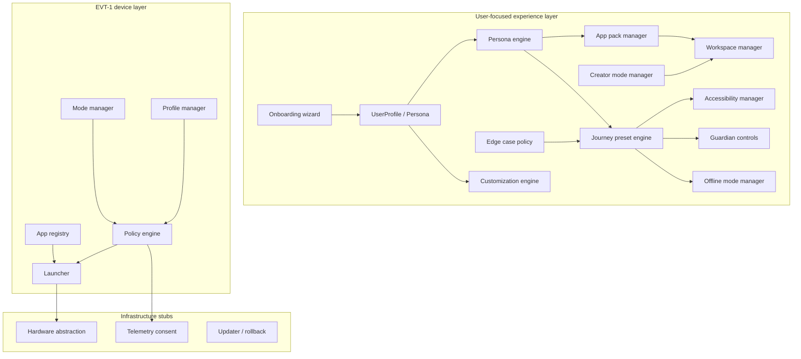

# User-Focused OS Architecture

**Status:** device OS alpha · user-focused OS experience layer · prototype OS package  

> This is a user-focused OS alpha package and launcher/customization framework. It is not yet a finished shipping OS image.

---

## 1. Purpose

The user-focused OS experience layer sits **above** kernel and hardware abstraction. It answers: *Who is using this device, what should it feel like, and which apps and policies apply?*

It does **not** replace a full operating system. It defines contracts for shell behavior, launcher logic, customization, and safe fallbacks that a future gunnchOS image would implement.

---

## 2. Layered model

---

## 3. Core modules (`gunnchos_device_os/`)

| Module | Responsibility |
|--------|----------------|
| `user_profile_schema.py` | Typed profile: persona, age_band, journey_preset, customization_depth, a11y needs |
| `persona_engine.py` | Map persona → preset, app pack, workspace, recommendations |
| `journey_preset_engine.py` | Load 12 presets from `config/journey_presets.yaml` |
| `customization_engine.py` | Theme, layout, widgets, pin apps, import/export |
| `theme_manager.py` | Theme tokens from `config/themes.yaml` |
| `workspace_manager.py` | Task-focused layouts from `config/workspaces.yaml` |
| `app_pack_manager.py` | Curated bundles from `config/app_packs.yaml` |
| `accessibility_manager.py` | 16 a11y features + preset defaults |
| `onboarding_wizard.py` | Seven-question first-run flow |
| `guardian_controls.py` | Mock age-band defaults (`mock: true`) |
| `offline_mode_manager.py` | Offline capabilities and sync placeholders |
| `creator_mode_manager.py` | Artist/writer/musician workflow definitions |
| `edge_case_policy.py` | Safe fallbacks for 24 exceptional situations |
| `user_state_store.py` | Profile persistence stub |
| `user_config_loader.py` | YAML config loading |

### EVT-1 integration modules

| Module | Responsibility |
|--------|----------------|
| `mode_manager.py` | School, Developer, Coder, Play, Media, Research Measurement, Admin |
| `profile_manager.py` | 8 deployment roles (student, educator, admin, …) |
| `policy_engine.py` | Allow/deny app launch by profile + mode |
| `launcher.py` | App launch with policy gate (mock) |
| `app_registry.py` | 15 registered apps with categories |

---

## 4. Configuration spine

| File | Contents |
|------|----------|
| `config/personas.yaml` | 22 personas |
| `config/journey_presets.yaml` | 12 workflow presets |
| `config/app_packs.yaml` | App bundles with offline flags |
| `config/workspaces.yaml` | Layout definitions + quick_actions |
| `config/themes.yaml` | Visual themes including kid_safe, high_contrast |
| `config/accessibility_defaults.yaml` | Global + per-preset a11y |
| `config/edge_cases.yaml` | User messages + fallback presets |

Validation: `scripts/validate_user_focused_os.py`, `scripts/validate_configs.py`.

---

## 5. Dual mode systems (important)

Two related but distinct concepts coexist:

| System | IDs | Use case |
|--------|-----|----------|
| **EVT modes** | School, Developer, Play, … | Fleet deployment, demo script, policy tests |
| **Journey presets** | scooter, studio, spaceship, … | User-facing complexity and UX defaults |

**Today:** Demos and docs use both. A future unification layer would map `persona + journey_preset → effective_mode_policy`.

**Not claimed:** Single unified runtime API exists today.

---

## 6. Data flow: first run

1. User completes `onboarding_wizard.run_onboarding(answers)`.
2. Wizard produces `UserProfile` with persona and journey_preset.
3. `persona_engine.recommend_for_profile()` returns app pack, workspace, next step.
4. `journey_preset_engine.get_preset()` supplies allowed/blocked apps and a11y defaults.
5. `accessibility_manager.apply_settings()` merges overrides.
6. If guardian required → `guardian_controls.enable_guardian_controls()`.
7. If offline → `offline_mode_manager.enable_offline_mode()`.
8. `CustomizationEngine` applies theme and layout preferences.
9. Launcher (mock) displays home screen from workspace + pinned apps.

---

## 7. Data flow: app launch (EVT path)

1. `launcher.launch_app(profile, mode, app_id)`
2. `policy_engine.evaluate(profile, mode, app_id)`
3. If denied → return reason (mode_not_permitted, policy_denied).
4. If allowed → mock launch dict with app metadata.

Edge cases (e.g. `steam_unavailable`) are handled at experience layer via `edge_case_policy.py` before or instead of launch.

---

## 8. Research launcher (`src/gunnchos_launcher/`)

Parallel package for 7GC / Edge-IO / fleet integration:

- `seven_gc_bridge.py`, `edge_io_bridge.py`, `gunnchai_bridge.py`
- `research_measurement_mode.py`, `school_fleet_policy.py`
- Tool adapters under `tool_adapters/`

Used by research demos and `make e2e` tool exports. Connects to user-focused layer via shared personas (e.g. `wireless_6g_researcher`) and app registry entries (`field_measurement`, `edge_io`).

---

## 9. UI surface

| Surface | Path | Status |
|---------|------|--------|
| Launcher mock | `apps/launcher_mock/` | npm React/Vite app; EVT mode switching |
| Demo JSON | `results/user_focused_os_demo_output.json` | Synthetic scenario output |
| EVT demo JSON | `results/device_os_evt1_demo_output.json` | CI-validated |

**Gap:** Launcher mock does not yet render all 12 presets; Python demos are the reference for user-focused flows.

---

## 10. Security and privacy touchpoints

- Guardian: no private content inspection by default (policy).
- Telemetry: tier per mode (`aggregated_opt_in`, `research_opt_in_only`, `minimal`).
- `telemetry_consent.py`, `src/telemetry/privacy_filter.py` — stub pipelines.
- See `docs/PRIVACY_AND_TELEMETRY_FOR_USERS.md`.

---

## 11. Extension points

| Extension | Hook |
|-----------|------|
| New persona | Add to `config/personas.yaml` + onboarding mapping |
| New preset | Add to `config/journey_presets.yaml` + validator |
| New app pack | Add to `config/app_packs.yaml` + registry |
| New workspace | Add to `config/workspaces.yaml` |
| New edge case | Add to `config/edge_cases.yaml` + `edge_case_policy.py` |
| Real app integration | Replace placeholder IDs in registry; keep policy gates |

---

## 12. Related documents

| Document | Topic |
|----------|-------|
| [CUSTOMIZATION_SYSTEM.md](CUSTOMIZATION_SYSTEM.md) | Themes and profiles |
| [SCOOTER_TO_SPACESHIP_MODEL.md](SCOOTER_TO_SPACESHIP_MODEL.md) | Complexity model |
| [APP_PACKS_AND_WORKSPACES.md](APP_PACKS_AND_WORKSPACES.md) | Bundles and layouts |
| [USER_FOCUSED_OS_LIMITATIONS.md](USER_FOCUSED_OS_LIMITATIONS.md) | Honest boundaries |
| `product/USER_FOCUSED_OS_PRD.md` | Product requirements |
| `docs/USER_FOCUSED_OS_AUDIT.md` | Repo audit |
