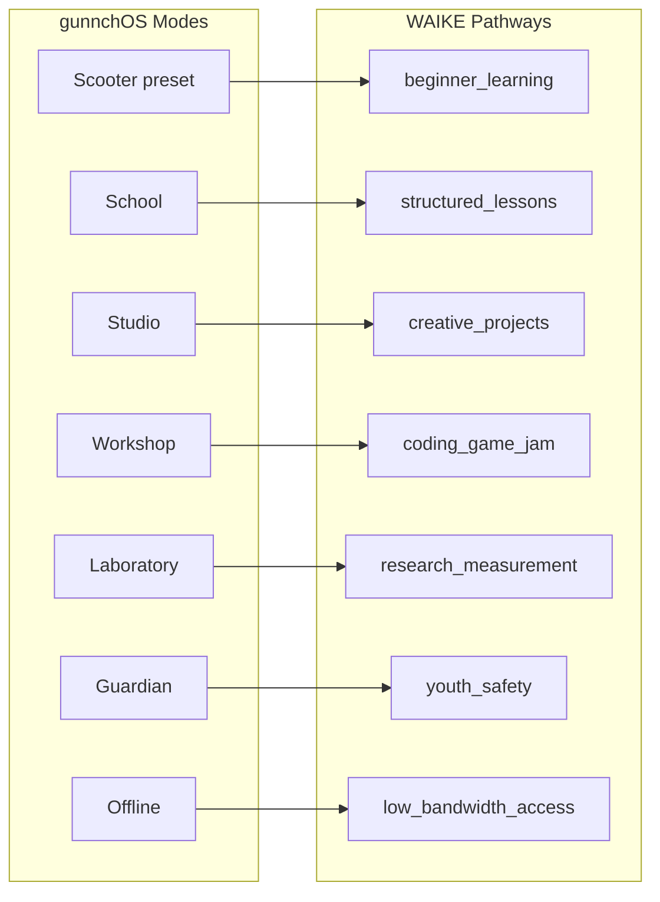

# WAIKE Device Pathways

**Status:** device OS alpha · mode-to-learning-track mapping  
**Sources:** `config/waike_student_tasks.yaml`, `config/modes.yaml`, `config/device_classes.yaml`, `config/journey_presets.yaml`

> This is a user-focused OS alpha package and launcher/customization framework. It is not yet a finished shipping OS image.

---

## Pathway overview

WAIKE **device pathways** connect gunnchOS **modes** to learning tracks that instructors can teach on real or mock hardware.

---

## Pathway definitions

| Pathway ID | Mode anchor | Primary device classes | Typical WAIKE outputs |
|------------|-------------|------------------------|---------------------|
| beginner_learning | Scooter / Bicycle presets | student_14_5, wearables_arena_set | color_match_score, letter traces |
| structured_lessons | School | student_14_5, handheld_hybrid | essays, diagrams, reading_progress |
| creative_projects | Studio | student_14_5 | story_draft.md, mood_board.canvas |
| coding_game_jam | Workshop | ds_xl_coder, handheld_hybrid | hello.py, level_prototype.json, test_results.txt |
| research_measurement | Laboratory / Research Measurement | ds_xl_coder | measurement_export.json/csv |
| youth_safety | Guardian | student_14_5 | screen_balance_checklist.md |
| low_bandwidth_access | Offline / Library | all with offline_caps | lesson_progress.json, anonymous_progress_token |

---

## Device class routing

| Device class | Recommended pathways | Restricted pathways |
|--------------|---------------------|---------------------|
| student_14_5 | structured_lessons, creative_projects, youth_safety | research_measurement (prefer ds_xl) |
| handheld_hybrid | coding_game_jam, beginner_learning | laboratory RF tasks |
| ds_xl_coder | coding_game_jam, research_measurement | beginner_learning (UX too complex) |
| wearables_arena_set | beginner_learning | workshop, research_measurement |

---

## 7GC campus scenarios (launcher mock)

Fleet view campus blurbs map research contexts to pathways:

| Campus | Emphasis pathway |
|--------|------------------|
| Gary | structured_lessons + youth_safety |
| Ghana | low_bandwidth_access |
| Gaza | youth_safety + privacy |
| Geelong | beginner_learning + accessibility |
| Graham Land | low_bandwidth_access + research_measurement |
| Germany | research_measurement + privacy |

Illustrative only — not operational deployments.

---

## Cross-repo pathway completion

| Pathway | Next repo |
|---------|-----------|
| research_measurement | edge-io-measurement-node |
| structured_lessons | waike-research-ops skill tree |
| coding_game_jam | gunnchAI3k mentor mode |

---

## Launcher mock path

User-focused view: Persona → Journey preset → App pack → Home summarizes active pathway visually.

---

## Claim boundary

Pathways describe **curriculum design intent** — not enforced routing in Python beyond mode YAML and demo configs.
