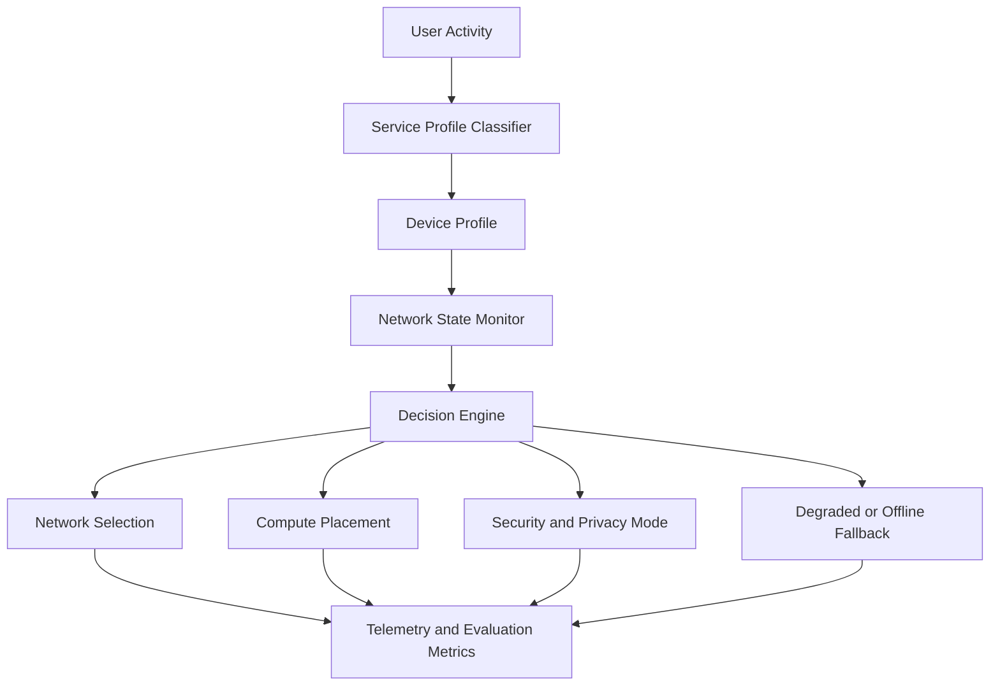

# Service-Aware Middleware Architecture

## Framing

gunnchOS is a service-aware OS/middleware research layer that maps user activity to connectivity, computation, energy, security, and quality-of-experience requirements.

It is NOT a finished operating system. It is NOT the primary dissertation contribution. It is the decision layer that enables evaluation of service-continuity methods by connecting human activity profiles to network/compute resource management.

## Architecture Overview

## Service Profiles

| Service profile | Example activities | Required system behavior |
|----------------|-------------------|------------------------|
| **Learn** | Lessons, video, tutoring, coursework | Stable access, caching, accessibility, session persistence |
| **Work** | Docs, dashboards, meetings | Reliability, privacy, sync, collaboration support |
| **Create** | Code/build/deploy | Local compute, peer transfer, versioning, edge offload |
| **Play** | Multiplayer, docked game, arena | Low latency, jitter control, session recovery |
| **Sense** | Haptics, HUD, body-area input | Ultra-low latency, energy control, privacy, safety priority |
| **Resilient** | Emergency/offline/low bandwidth | Graceful degradation, delay tolerance, recovery prioritization |

## Device Profiles

| Device profile | Device | Compute class | Energy class | Connectivity class |
|---------------|--------|--------------|-------------|-------------------|
| **Desk** | Student 14.5" | Moderate (laptop-class) | Battery (8h+) | Wi-Fi primary, cellular backup |
| **Mobile** | Handheld Hybrid | Mobile SoC | Battery (6h+) | Cellular primary, Wi-Fi opportunistic |
| **Creator** | DS-XL Coder | High local (GPU/NPU) | Plugged or battery (4h+) | Local-edge primary, WAN for sync |
| **Embodied** | Edge IO Wearables | Ultra-low-power MCU | Coin/small LiPo (hours) | BLE/UWB to hub, local-edge |

## Network Profiles

| Network profile | Technology | Latency class | Throughput class | Reliability class |
|----------------|-----------|--------------|-----------------|-------------------|
| **Broadband** | Wi-Fi 6/6E, fiber | Low (<20ms) | High (100+ Mbps) | High |
| **Cellular** | 4G/5G/future 6G | Medium (20–50ms) | Medium-High | Medium-High |
| **NTN** | LEO satellite, HAPS | High (50–600ms) | Low-Medium | Variable |
| **Local-edge** | LAN, edge server, mesh | Very low (<10ms) | High (local) | High (local) |
| **Device-to-device** | BLE, UWB, Wi-Fi Direct | Very low (<5ms) | Low-Medium | Variable |
| **Offline** | Local storage only | N/A | N/A | N/A (cached) |

## Degraded/Offline Behavior

| Service profile | Degraded behavior | Minimum acceptable state | Recovery priority |
|----------------|-------------------|------------------------|-------------------|
| Learn | Cached content; defer submissions | Read-only last-synced materials | Medium |
| Work | Offline editing; queue sync | Document editing with deferred save | Medium-High |
| Create | Full local operation; queue sync | Complete local build-test cycle | Low (local-first) |
| Play | Reduce fidelity; LAN-only | Local or LAN session | Medium |
| Sense | Maintain safety alerts; reduce haptics | Safety-critical alerts active | Critical |
| Resilient | Already degraded by definition | Basic communication and safety | Critical |

## Security/Privacy Modes

| Profile | Data sensitivity | Local-only processing | Encryption | Special constraints |
|---------|-----------------|----------------------|-----------|-------------------|
| Learn | Medium (learner identity) | Preferred for credentials | Required | Guardian policy for minors |
| Work | Medium-High (business data) | Preferred for documents | Required | Access control |
| Create | Medium (code IP) | Required for proprietary code | Required | Peer trust for D2D |
| Play | Low-Medium | Not required | Standard | Fair-play integrity |
| Sense | High (body data) | Required for biometric-like | Required | Data minimization mandatory |
| Resilient | Variable (emergency) | Safety overrides privacy | Best-effort | Life-safety priority |

## Open/Private/Reproducible Boundaries

| Component | Open/reproducible | Private/proprietary | Simulated for research |
|-----------|-------------------|--------------------|-----------------------|
| Service profile definitions | Open | — | — |
| Decision engine algorithm | Open (research contribution) | — | — |
| Network selection logic | Open (research contribution) | — | — |
| Device profile specifications | Open | — | — |
| Telemetry schema | Open | — | — |
| Implementation code (prototype) | To be determined | Possibly partial | Simulated alternative available |
| Full OS distribution | — | Proprietary (not PhD deliverable) | Not required for research |

## Simulated vs. Implemented Components

| Component | Current state | Simulation path | Implementation path | Required for PhD? |
|-----------|--------------|----------------|--------------------|--------------------|
| Service profile classifier | Concept | Rule-based on workload traces | Integrated middleware | Simulation sufficient |
| Decision engine | Concept | Discrete-event simulation | Prototype daemon | Simulation sufficient |
| Network selection | Concept | ns-3 / digital-twin model | Real switching (Wi-Fi/cell) | Simulation sufficient |
| Compute placement | Concept | Modeled response times | Edge server prototype | Simulation sufficient |
| Degraded-mode behavior | Concept | Emulated outage scenarios | Real impairment testing | Simulation primary |
| Telemetry | Concept | Logged from simulation | Logged from prototype | Either acceptable |
| Mode manager | Phase 0-1 | — | Python prototype exists | Exists |
| Device profiles | Complete | — | YAML specs exist | Exists |

## Closing statement

gunnchOS is not claimed as a finished product. It is a research middleware concept used to study how service profiles can guide network selection, computation placement, graceful degradation, and quality-of-experience management across affordable edge devices.
