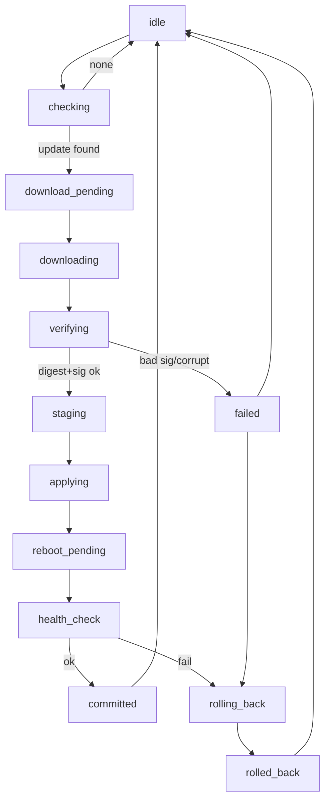

# Update / recovery activity — current simulation

Source: `gunnchos_device_os/ota_state_machine.py` `ALLOWED_TRANSITIONS`.
Not a live OTA channel. Make: no production signing.

Boot recovery playbook: `gunnchos_device_os/boot/recovery.py` `RECOVERY_PLAYBOOK`
(missing service, corrupt manifest, stale image, unsupported arch, storage, network).
