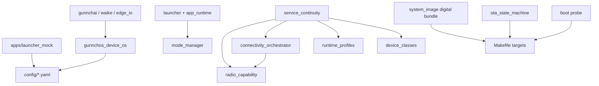

# Component — current

```mermaid
flowchart TB
  LM[apps/launcher_mock]
  PY[gunnchos_device_os]
  CFG[config/*.yaml]
  SC[service_continuity]
  BOOT[boot probe]
  MODE[mode_manager]
  LAUNCH[launcher + app_runtime]
  ORCH[connectivity_orchestrator]
  RADIO[radio_capability]
  RT[runtime_profiles]
  DC[device_classes]
  OTA[ota_state_machine]
  BRIDGE[gunnchai / waike / edge_io]
  IMG[system_image digital bundle]
  MAKE[Makefile targets]
  LM --> CFG
  PY --> CFG
  SC --> DC
  SC --> RT
  SC --> ORCH
  SC --> RADIO
  LAUNCH --> MODE
  ORCH --> RADIO
  BOOT --> MAKE
  OTA --> MAKE
  BRIDGE --> PY
  IMG --> MAKE
```

There is no production initramfs or signed factory image in this tree.
`make bootable-reference` and `make system-image` are **DEV/VM digital paths**.
