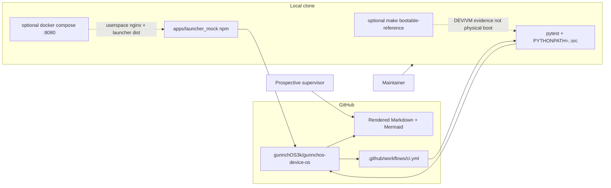

# Deployment — current

```mermaid
flowchart LR
  subgraph github [GitHub]
    REPO[gunnchOS3k/gunnchos-device-os]
    GHA[.github/workflows/ci.yml]
    MD[Rendered Markdown + Mermaid]
  end
  subgraph local [Local clone]
    PY[pytest + PYTHONPATH=.:src]
    NODE[apps/launcher_mock npm]
    DK[optional docker compose :8080]
    QEMU[optional make bootable-reference]
  end
  DEV[Maintainer] --> local
  PY --> REPO
  NODE --> REPO
  REPO --> MD
  REPO --> GHA
  GHA --> PY
  SUP[Prospective supervisor] --> MD
  DK -.->|userspace nginx + launcher dist| NODE
  QEMU -.->|DEV/VM evidence not physical boot| PY
```

`docker compose -f os_build/linux_desktop/docker-compose.yml up` serves the
**launcher mock** on port 8080. That is a container prototype, not a shipping OS image.
