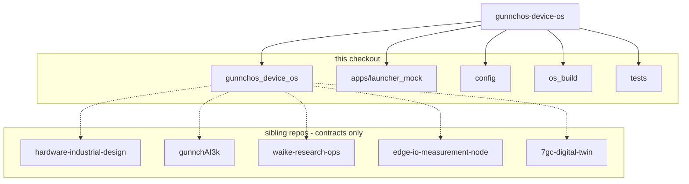

# Package / repository relationship — current

This repo is RQ1 core infrastructure. It does not vendor RAN or hardware CAD.

Firmware/hardware manifests are **mirrored and simulated** here
(`hardware_compat/`, `cross_repo_firmware_bridge/`). Physical board proof remains pending.
