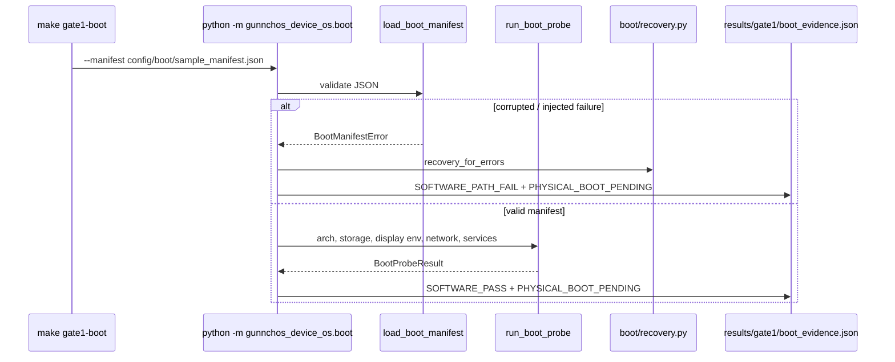

# Boot sequence — current software probe

Source: `gunnchos_device_os/boot/probe.py` `run_boot_probe`, Make `gate1-boot`.

Always co-emits `GUNNCHOS_PHYSICAL_BOOT_PENDING`. Physical capture is a separate path
(`gunnchos_device_os/boot/physical.py`) and is not claimed here.

Make target: `gate1-boot` / `gate1-test`.
