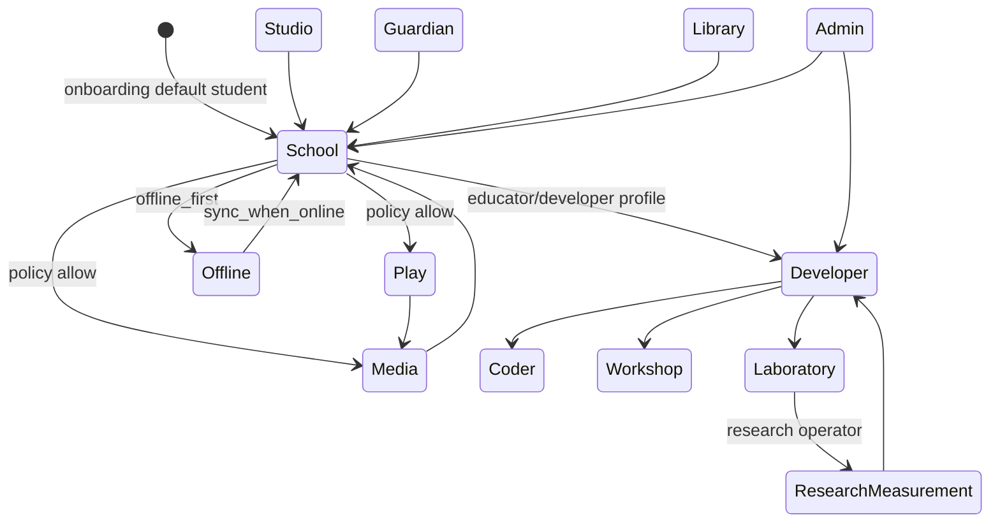

# Mode state machine — current

Source: `gunnchos_device_os/mode_manager.py` loading `config/modes.yaml`.
Shell UI: `apps/launcher_mock/src/shell/ModeSelectorBar.tsx`.

Policy, not a kernel LSM. Blocked combinations come from `policy_engine.evaluate`
and per-class `supported_modes` in `config/device_classes.yaml`.

Wearable class (`wearables_arena_set`) only lists Play, School, Offline, Library
in YAML — Developer/Admin transitions are **not** supported for that class.
