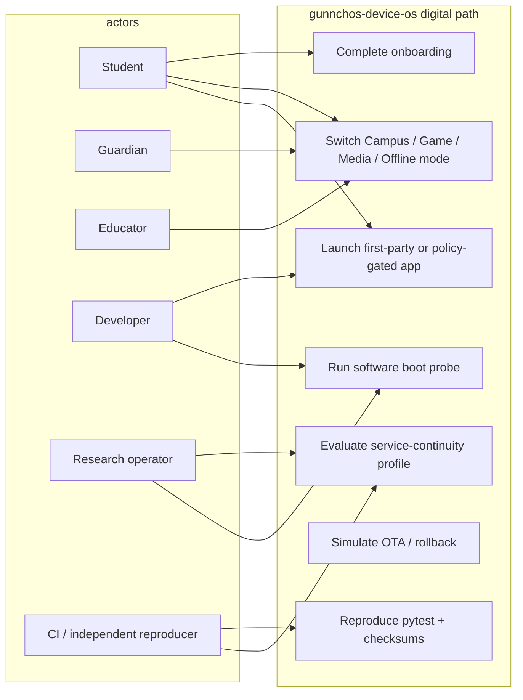

# Use case — current

Actors: student, guardian, educator, developer, research operator, CI/reproducer.
This repo does **not** execute RAN control or physical boot.

RQ1 mapping: four research classes (desk / mobile-docked / local-creation / wearable)
are aliases of `config/device_classes.yaml` IDs — see
`gunnchos_device_os/service_continuity/`.

Code: `gunnchos_device_os/onboarding_wizard.py`, `mode_manager.py`, `launcher.py`,
`boot/probe.py`, `ota_state_machine.py`, `apps/launcher_mock`.
