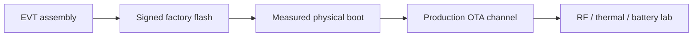

# Future — physical boot and factory

Not implemented in this checkout as proven evidence.

Status words: `GUNNCHOS_PHYSICAL_BOOT_PENDING`,
`GUNNCHOS_PHYSICAL_SYSTEM_IMAGE_PENDING`, `PHYSICAL_EXECUTION_FREEZE`.

Do not treat `make bootable-reference` or Docker :8080 as this diagram.
