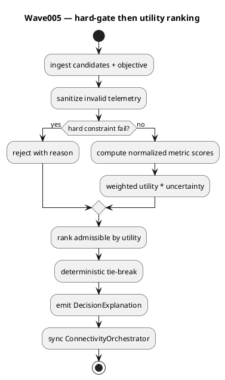

# wave005_activity

```plantuml
@startuml wave005_activity
title Wave005 — hard-gate then utility ranking
start
:ingest candidates + objective;
:sanitize invalid telemetry;
if (hard constraint fail?) then (yes)
  :reject with reason;
else (no)
  :compute normalized metric scores;
  :weighted utility * uncertainty;
endif
:rank admissible by utility;
:deterministic tie-break;
:emit DecisionExplanation;
:sync ConnectivityOrchestrator;
stop
@enduml
```
