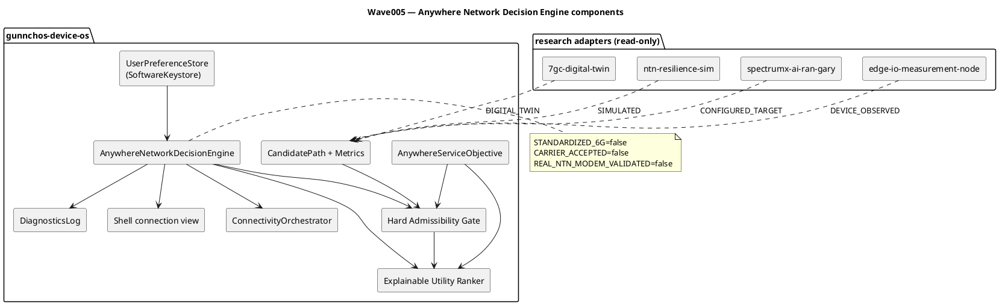

# wave005_component

```plantuml
@startuml wave005_component
title Wave005 — Anywhere Network Decision Engine components
skinparam componentStyle rectangle

package "gunnchos-device-os" {
  [ConnectivityOrchestrator] as Orch
  [AnywhereNetworkDecisionEngine] as Eng
  [AnywhereServiceObjective] as Obj
  [CandidatePath + Metrics] as Cand
  [Hard Admissibility Gate] as Hard
  [Explainable Utility Ranker] as Util
  [UserPreferenceStore\n(SoftwareKeystore)] as Pref
  [DiagnosticsLog] as Diag
  [Shell connection view] as Shell
}

package "research adapters (read-only)" {
  [7gc-digital-twin] as Twin
  [ntn-resilience-sim] as Ntn
  [spectrumx-ai-ran-gary] as Spec
  [edge-io-measurement-node] as Edge
}

Cand --> Hard
Hard --> Util
Obj --> Hard
Obj --> Util
Pref --> Eng
Eng --> Hard
Eng --> Util
Eng --> Orch
Eng --> Diag
Eng --> Shell
Twin ..> Cand : DIGITAL_TWIN
Ntn ..> Cand : SIMULATED
Spec ..> Cand : CONFIGURED_TARGET
Edge ..> Cand : DEVICE_OBSERVED

note right of Eng
  STANDARDIZED_6G=false
  CARRIER_ACCEPTED=false
  REAL_NTN_MODEM_VALIDATED=false
end note
@enduml
```
