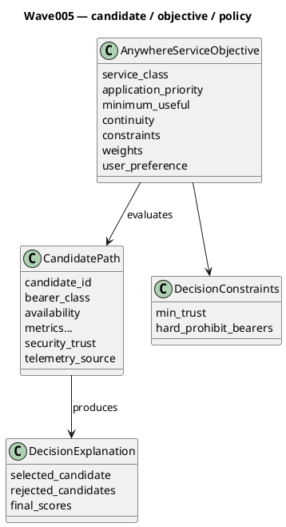

# wave005_domain

```plantuml
@startuml wave005_domain
title Wave005 — candidate / objective / policy
class AnywhereServiceObjective {
  service_class
  application_priority
  minimum_useful
  continuity
  constraints
  weights
  user_preference
}
class CandidatePath {
  candidate_id
  bearer_class
  availability
  metrics...
  security_trust
  telemetry_source
}
class DecisionConstraints {
  min_trust
  hard_prohibit_bearers
}
class DecisionExplanation {
  selected_candidate
  rejected_candidates
  final_scores
}
AnywhereServiceObjective --> DecisionConstraints
AnywhereServiceObjective --> CandidatePath : evaluates
CandidatePath --> DecisionExplanation : produces
@enduml
```
