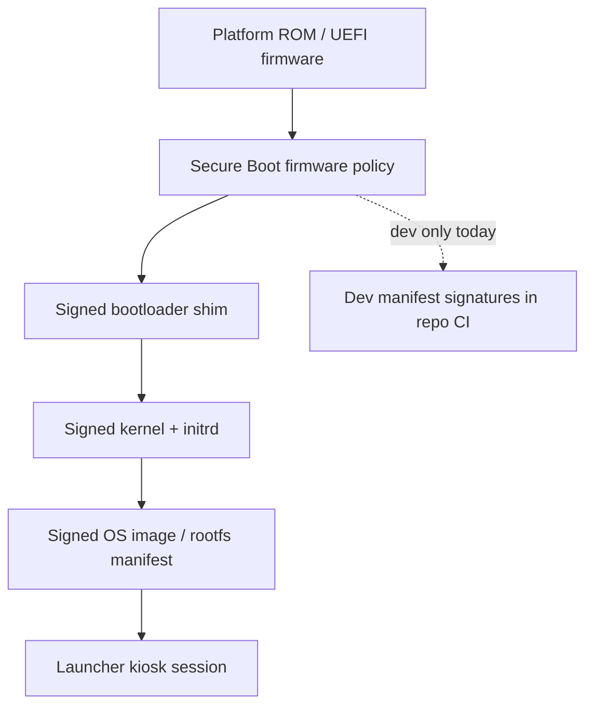

# Secure Boot Architecture (Phase 4D — design track)

**Status:** Architecture and dev signing prototype only. Not wired into bootloader or kernel.

## Boot chain (target)

## Key hierarchy

| Role | Purpose | Phase 4D |
|------|---------|----------|
| Root of trust | Platform firmware / TPM | Documented only |
| Bootloader signing key | Signs GRUB/shim | Not generated in repo |
| Kernel signing key | Signs kernel + modules | Not generated in repo |
| Image signing key | Signs release manifest + artifact checksums | **Dev key in `dev_keys/`** |
| Recovery signing key | Offline recovery images | Documented only |

## Signing key roles

1. **Image manifest key** — signs `version_manifest.json` checksum bundle (implemented for dev).
2. **Bootloader key** — future; signs first-stage loader verified by firmware.
3. **Kernel key** — future; extends trust to kernel and initramfs.
4. **Recovery key** — future; separate offline ceremony for factory reset images.

## Development vs production keys

| Aspect | Development | Production |
|--------|-------------|------------|
| Storage | Local PEM in gitignored `dev_keys/` | HSM / offline ceremony |
| Trust anchor | None (self-signed) | OEM / platform CA |
| Use | CI manifest signing smoke tests | Factory flash + OTA |
| Rotation | Regenerate freely | Audited rotation policy |

## Image signing plan

1. Build produces artifact tarball + `MANIFEST.json` with checksums.
2. `scripts/sign_release_manifest.py` signs manifest digest with dev image key.
3. Device boot path (future): firmware verifies bootloader → kernel verifies rootfs manifest signature.
4. Launcher reads signed manifest before applying OTA (future).

## Rollback protection plan

- Maintain monotonic **security version** in signed manifest.
- Firmware refuses images with `security_version` lower than fused minimum (future silicon step).
- Recovery partition holds last-known-good signed image (design only).

## Measured boot / TPM notes

- Target: extend PCRs with bootloader, kernel, and manifest measurements.
- Attestation report exported to MDM for fleet health (future).
- Phase 4D: document PCR intent only — no TPM integration in launcher shell.

## Recovery key process (design)

1. Guardian enrollment generates recovery escrow record (future MDM).
2. Recovery USB image signed with recovery key, verified at boot menu.
3. Factory reset clears user data partition; re-enrollment required.

## Secure boot checklist

See [SECURE_BOOT_CHECKLIST.md](SECURE_BOOT_CHECKLIST.md).
